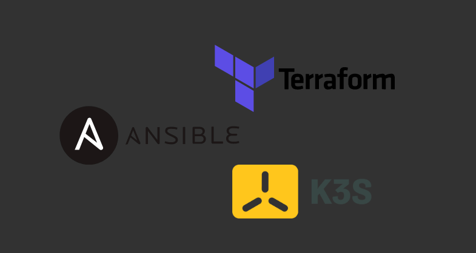
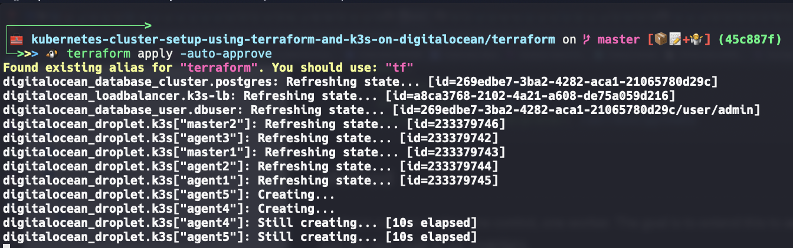

 

# Set up HA k3s cluster on DigitalOcean using Terraform + Ansible

This demo aims to demonstrate how we can use set up your our Kubernetes cluster using lightweight Kubernetes distribution called [k3s](https://k3s.io) on DigitalOcean using IAC principle with [Terraform](https://www.terraform.io) and [Ansible](https://www.ansible.com).

# 🎁 Table of contents
<!-- START doctoc generated TOC please keep comment here to allow auto update -->
<!-- DON'T EDIT THIS SECTION, INSTEAD RE-RUN doctoc TO UPDATE -->
- 🎯 [Which audience are we targeting ?](#which-audience-are-we-targeting-)
- 🧰 [Prerequisites](#prerequisites)
-  [What is k3s ?](#what-is-k3s-)
- 🤔 [What is IAC(Infrastructure As Code) principle ?](#what-is-iacinfrastructure-as-code-principle-)
-  [What is Terraform ?](#what-is-terraform-)
-  [What is Terraform Cloud ?](#what-is-terraform-cloud-)
-  [What is Ansible ?](#what-is-ansible-)
-  [What is Ansible Roles ?](#what-is-ansible-roles-)
- 👨‍💻 [Hands On](#hands-on)
- 🚀 [Further More](#further-more)

<!-- END doctoc generated TOC please keep comment here to allow auto update -->

# Which audience are we targeting ?

* If you are a Software Engineer and wants to set up a lightweigth cluster for demo purposes.
* If you are curious about k3s and wants to try it out on a cloud such as DigitalOcean.
* If you are a DevOps Engineer and wants to learn how you can set up k3s cluster with HA(Highly Available) mode on DigitalOcean.
* If you are a System Engineer and wants to learn how to automate a setting up k3s cluster using Ansible roles.

You are at the right place. 👌

# Prerequisites

*  DigitalOcean Account
*  Terraform Cloud
*  Terraform v0.14.7
*  Ansible 2.10.5

> I'm going to do this demo on my macOS Catalina 1.15.7, if you are on the same environment, you can use [brew](https://brew.sh) which is a package manager for macOS to setup all the tools that we mention above.

# What is k3s ?
K3s is a fully compliant Kubernetes distribution with the following enhancement:

* Packaged as a single binary.
* Lightweight storage backend based on sqlite3 as the default storage mechanism. etcd3, MySQL, Postgres also still available.
* Wrapped in simple launcher that handles a lot of the complexity of TLS and options.
* Secure by default with reasonable defaults for lightweight environments.
* Simple but powerful “batteries-included” features have been added, such as: a local storage provider, a service load balancer, a Helm controller, and the Traefik ingress controller.
* Operation of all Kubernetes control plane components is encapsulated in a single binary and process. This allows K3s to automate and manage complex cluster operations like distributing certificates.
* External dependencies have been minimized (just a modern kernel and cgroup mounts needed). K3s packages required dependencies, including:
  * containerd
  * Flannel
  * CoreDNS
  * CNI
  * Host utilities (iptables, socat, etc)
  * Ingress controller (traefik)
  * Embedded service loadbalancer
  * Embedded network policy controller

> Credit: https://rancher.com/docs/k3s/latest/en/
# What is IAC(Infrastructure As Code) principle ?
Infrastructure as code is the process of managing and provisioning computer data centers through machine-readable definition files, rather than physical hardware configuration or interactive configuration tools.

> Credit: https://en.wikipedia.org/w/index.php?title=Infrastructure_as_code&oldid=903249795

# What is Terraform ?
Terraform is an open-source infrastructure as code software tool that provides a consistent CLI workflow to manage hundreds of cloud services. Terraform codifies cloud APIs into declarative configuration files.

> Credit: https://www.terraform.io

# What is Terraform Cloud ?
Terraform Cloud is an application that helps teams use Terraform together. It manages Terraform runsin a consistent and reliable environment, and includes easy access to shared state and secret data, access controls for approving changes to infrastructure, a private registry for sharing Terraform modules, detailed policy controls for governing the contents of Terraform configurations, and more.

> Credit: https://www.terraform.io/docs/cloud/index.html#about-terraform-cloud-and-terraform-enterprise

# What is Ansible ?
Ansible is a software tool that provides simple but powerful automation for cross-platform computer support. It is primarily intended for IT professionals, who use it for application deployment, updates on workstations and servers, cloud provisioning, configuration management, intra-service orchestration, and nearly anything a systems administrator does on a weekly or daily basis.

> Credit: https://opensource.com/resources/what-ansible

# What is Ansible Roles ?
Roles let you automatically load related vars_files, tasks, handlers, and other Ansible artifacts based on a known file structure. Once you group your content in roles, you can easily reuse them and share them with other users.

> Credit: https://docs.ansible.com/ansible/latest/user_guide/playbooks_reuse_roles.html

# Hands On
In this demo, we are going to set up highly available k3s cluster. We are going to provision 2 master nodes behind the LB(LoadBalancer) to provide HA support and 3 worker nodes. After provision the nodes, we'll use the Ansible as local provisioner. In Ansible, we'll use the Ansible Role called ['xanmanning.k3s'](https://galaxy.ansible.com/xanmanning/k3s) to automate the installation of k3s onto the master and worker nodes.

> *P.S:* We are going to use Terraform Cloud as a Terraform Backend to store our Terraform state, before you getting started, please go the following [link](https://www.terraform.io/docs/cli/config/config-file.html#credentials-1) and configure your terraform cli to be able to store state file in the Terraform Cloud.

Lets start with our [provider.tf](./terraform/provider.tf) file that includes our provider and variables definitions.
```tf
terraform {
  required_providers {
    digitalocean = {
      source  = "digitalocean/digitalocean"
      version = "1.22.2"
    }
  }

  backend "remote" {
    organization = "devquy"

    workspaces {
      name = "digitalocean"
    }
  }
}

variable "do_token" {}
variable "pvt_key" {}
variable "database_user" {}

variable "nodes" {
  type = set(object({
    name = string
    tag  = string
  }))
  default = [
    {
      name = "master1"
      tag  = "master"
    },
    {
      name = "master2",
      tag  = "master"
    },
    {
      name = "agent1",
      tag  = "agent"
      }, {
      name = "agent2",
      tag  = "agent"
    },
    {
      name = "agent3",
      tag  = "agent"
    }
  ]
}

provider "digitalocean" {
  token = var.do_token
}

data "digitalocean_ssh_key" "terraform" {
  name = "my-ssh-key"
}
```

You should notice here that we are using DigitalOcean as a [provider]((https://registry.terraform.io/providers/digitalocean/digitalocean/latest/docs)) and bunch of configuration variables.

Lets continue with [k3s-droplets.tf](./terraform/k3s-droplets.tf) which includes the definitions of our droplets.
```tf
resource "digitalocean_droplet" "k3s" {
  for_each = {for i, v in var.nodes: v.name => v.tag}
  image = "ubuntu-20-04-x64"
  name = each.key
  region = "fra1"
  size = "s-1vcpu-1gb"
  private_networking = true

  ssh_keys = [
    data.digitalocean_ssh_key.terraform.id
  ]

  tags = [ each.value ]

  provisioner "remote-exec" {
   inline = ["sudo apt update", "sudo apt install python3 -y", "echo Done!"]

   connection {
     host        = self.ipv4_address
     type        = "ssh"
     user        = "root"
     private_key = file(var.pvt_key)
    }
  }

 provisioner "local-exec" {
   working_dir = "${path.cwd}/../ansible"
   command = <<-EOF
   do-ansible-inventory --group-by-tag > hosts.ini
   ansible-playbook setup_cluster_playbook.yaml -u root --private-key ~/.ssh/digitalocean_rsa --extra-vars "loadbalancer_ip=${digitalocean_loadbalancer.k3s-lb.ip} database_host=${digitalocean_database_cluster.postgres.host} database_user=admin database_password=${digitalocean_database_user.dbuser.password} database_name=${digitalocean_database_cluster.postgres.database} database_port=${digitalocean_database_cluster.postgres.port}"
 EOF
 }

  depends_on = [ digitalocean_database_cluster.postgres, digitalocean_loadbalancer.k3s-lb ]
}
```

You should notice here that we are using the Ansible in the provisioner section called `local-exec`. In this provisioner section, we'll set up our k3s onto the droplets after each provisioned. There is a tool called ["do-ansible-inventory"](https://github.com/do-community/do-ansible-inventory) which helps us to enable [Dynamic Inventory Management](https://docs.ansible.com/ansible/latest/user_guide/intro_dynamic_inventory.html) feature. Basically, it'll create a [host.ini](./ansible/host.ini) file dynamically based on the droplets.

Finally, lets look at the [setup_cluster_playbook](./ansible/setup_cluster_playbook.yaml) automation file.
```yaml
---
- name: Set up k3s cluster
  hosts: all
  become: True
  vars:
    k3s_control_node_address: "{{ loadbalancer_ip }}"
    k3s_server:
      disable:
        - traefik
      datastore-endpoint: postgres://{{ database_user }}:{{ database_password }}@{{ database_host }}:{{ database_port }}/{{ database_name }}
  pre_tasks:
    - name: Set each node to be a control node
      ansible.builtin.set_fact:
        k3s_control_node: true
      when: inventory_hostname in ['master1', 'master2']
  roles:
    - role: 'xanmanning.k3s'
```

Lets clarify here, this role is going to set `master1` and `master2` as a k3s control node, but what is the `master1` and `master2`, these are the droplet names that we defined as a variable in the provider.tf file, so, `do-ansible-inventory` tool will generate the `host.ini` based on that tags. Then, these role will use this names to define which of them are node or server. In this case, we defined `node1`, `node2` and `node3` for our worker nodes and `master1`, `master2` for our control plane nodes.

That's it, let's provision our infrastructure.
```bash
$ cd terraform
$ terraform init
Found existing alias for "terraform". You should use: "tf"

Initializing the backend...

Successfully configured the backend "remote"! Terraform will automatically
use this backend unless the backend configuration changes.

Initializing provider plugins...
- Finding digitalocean/digitalocean versions matching "1.22.2"...
- Installing digitalocean/digitalocean v1.22.2...
- Installed digitalocean/digitalocean v1.22.2 (signed by a HashiCorp partner, key ID F82037E524B9C0E8)

Partner and community providers are signed by their developers.
If you'd like to know more about provider signing, you can read about it here:
https://www.terraform.io/docs/cli/plugins/signing.html

Terraform has created a lock file .terraform.lock.hcl to record the provider
selections it made above. Include this file in your version control repository
so that Terraform can guarantee to make the same selections by default when
you run "terraform init" in the future.

Terraform has been successfully initialized!

You may now begin working with Terraform. Try running "terraform plan" to see
any changes that are required for your infrastructure. All Terraform commands
should now work.

If you ever set or change modules or backend configuration for Terraform,
rerun this command to reinitialize your working directory. If you forget, other
commands will detect it and remind you to do so if necessary.
Execution time: 0h:00m:07s sec
```

In the above, we initialized the corresponding provider, this is the required step for Terraform.

Let's apply our desired state.
```bash
$ terraform apply -auto-approve
Found existing alias for "terraform". You should use: "tf"
digitalocean_droplet.k3s-agent["node3"]: Creating...
digitalocean_droplet.k3s-agent["node2"]: Creating...
digitalocean_droplet.k3s-agent["node1"]: Creating...
digitalocean_database_cluster.postgres: Creating...
digitalocean_loadbalancer.k3s-master-lb: Creating...
^[digitalocean_database_cluster.postgres: Still creating... [10s elapsed]
digitalocean_droplet.k3s-agent["node3"]: Still creating... [10s elapsed]
digitalocean_droplet.k3s-agent["node2"]: Still creating... [10s elapsed]
digitalocean_droplet.k3s-agent["node1"]: Still creating... [10s elapsed]
digitalocean_loadbalancer.k3s-master-lb: Still creating... [10s elapsed]
digitalocean_droplet.k3s-agent["node2"]: Still creating... [20s elapsed]
digitalocean_droplet.k3s-agent["node1"]: Still creating... [20s elapsed]
digitalocean_database_cluster.postgres: Still creating... [20s elapsed]
digitalocean_droplet.k3s-agent["node3"]: Still creating... [20s elapsed]
digitalocean_loadbalancer.k3s-master-lb: Still creating... [20s elapsed]
...
```
Here is the screenshot from our DigitalOcean account which shows us the actual representation of our desired state.


In the last step, we need to clone the `k3s.yaml` from one of the masters to connect to the cluster using kubectl, don't forget to update kubeconfig file with the LB ip.
```bash
$ cd kubectl
$ rclone copy master1:/etc/rancher/k3s/k3s.yaml ./kubeconfig
$ LB_IP=164.90.243.154
$ sed -i '' "s/127.0.0.1/$LB_IP/g" kubeconfig/k3s.yaml
# remove the ca certificate detail then add inscure-skip-tls-verify: true in the cluster section
# final cluster section of the configuration should looks like $ rclone copy master1:/etc/rancher/k3s/k3s.yaml ./kubeconfig
# - cluster:
#     insecure-skip-tls-verify: true
#     server: https://164.90.243.154:6443
$ export KUBECONFIG=kubeconfig/k3s.yaml
$ kubectl get nodes -o wide
NAME      STATUS   ROLES                  AGE     VERSION        INTERNAL-IP      EXTERNAL-IP   OS-IMAGE             KERNEL-VERSION     CONTAINER-RUNTIME
node3     Ready    <none>                 4m43s   v1.20.2+k3s1   167.71.44.122    <none>        Ubuntu 20.04.1 LTS   5.4.0-51-generic   containerd://1.4.3-k3s1
master1   Ready    control-plane,master   12m     v1.20.2+k3s1   139.59.140.50    <none>        Ubuntu 20.04.1 LTS   5.4.0-51-generic   containerd://1.4.3-k3s1
master2   Ready    control-plane,master   11m     v1.20.2+k3s1   207.154.242.37   <none>        Ubuntu 20.04.1 LTS   5.4.0-51-generic   containerd://1.4.3-k3s1
node2     Ready    <none>                 10m     v1.20.2+k3s1   167.71.58.7      <none>        Ubuntu 20.04.1 LTS   5.4.0-51-generic   containerd://1.4.3-k3s1
node1     Ready    <none>                 10m     v1.20.2+k3s1   165.22.24.74     <none>        Ubuntu 20.04.1 LTS   5.4.0-51-generic   containerd://1.4.3-k3s1
```
> I'm using [rclone](https://rclone.org) tool to get files from remote to my host.

Tadaaaa 🎉🎉🎉🎉

# Further More
If you decide to extend your cluster at any time, the only thing that you need to do is adding new nodes to the node list variable defined in the [provider.tf](./terraform/provider.tf) file.
```tf
variable "nodes" {
  type = set(object({
    name = string
    tag  = string
  }))
  default = [
    {
      name = "master1"
      tag  = "master"
    },
    {
      name = "master2",
      tag  = "master"
    },
    {
      name = "agent1",
      tag  = "agent"
      }, {
      name = "agent2",
      tag  = "agent"
    },
    {
      name = "agent3",
      tag  = "agent"
    },
    {
     name = "agent4",
     tag = "agent"
    },
    {
     name = "agent5",
     tag = "agent"
    }
  ]
}

```
You should notice that we added two new nodes like `agent4` and `agent5`, after we defined them, if we execute the `terraform apply` again, we should see the similar output above:

